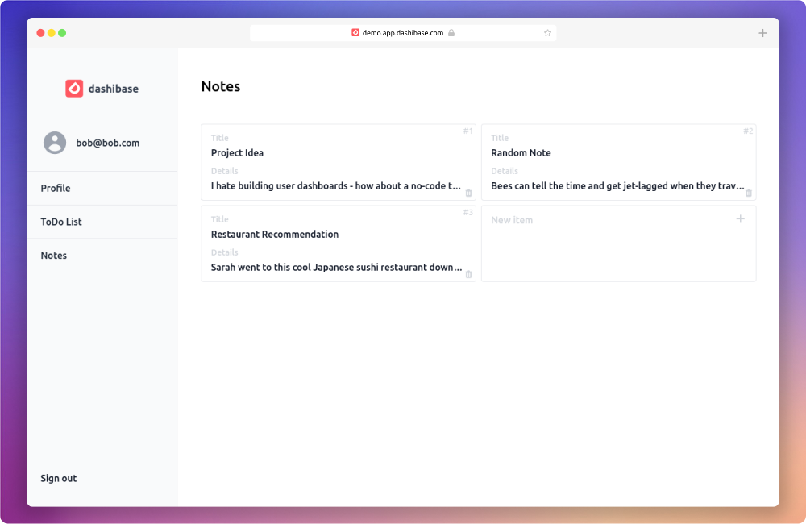

<p align="center">

<h1 align="center"><b>Dashibase</b></h1>
<p align="center">
  Lightspeed app-builder for Supabase users.
    <br />
    <a href="https://dashibase.com"><strong>Check it out now ⚡</strong></a>
  </p>
</p>

Need to build an app or a dashboard? Dashibase is the fastest app-builder for Supabase users.

Beautiful presets in light and dark modes. CRUD interfaces with cards and table views. Form validation, elegant login and signup pages, and more. All with a simple JSON config file.

<p align="center">
  
  <br />
  <br />
  <a href="https://dashibase.com#join-waitlist">
    
  </a>
  <a href="https://twitter.com/dashibase">
    
  </a>
  <a href="https://join.slack.com/t/dashibase-community/shared_invite/zt-180rycyqv-ifRwyiQAiXUlBBVxgxQE7g">
    
  </a>
  
  <br />
</p>

This repo contains the open-source code for setting up your own Dashibase dashboard if you are interested in hosting it yourself. Otherwise, we also have a [hosted version](https://dashibase.com#join-waitlist).

Contributions welcome!

**Have suggestions for what to work on next? Support us by joining our [beta](https://dashibase.com#join-waitlist)!**

---

## Features

### Supported

- [x] Authentication UIs including sign in and sign up
- [x] Multiple display modes - single, list, card
- [x] CRUD functions
- [x] Simple form validation during item creation by checking that required fields are filled in (required attributes are configured in `src/dashibaseConfig.ts`)
- [x] Caching of dashboard data to reduce database queries and improve latency
- [x] Dashboard is responsive and works on tablet and mobile
- [x] Pagination support
- [x] Filter and sort for list and card views

### In-progress

- [ ] Better support for table joins
- [ ] Charts display mode
- [ ] Third-party authentication support

### Backlog

- [ ] Built-in analytics
- [ ] User impersonation
- [ ] Kanban display mode
- [ ] Regex form validation

## Getting Started

**1. Clone this repository and go to the Dashibase directory**

```bash
git clone https://github.com/dashibase/dashibase
cd dashibase
```

**2. Edit `src/dashibaseConfig.ts` to configure your dashboard.**

See [here](https://github.com/dashibase/dashibase/blob/main/src/utils/config.ts) for documentation on the config file.

**3. Test it locally**

We currently don't have a staging mode yet but you should be able to test it locally with your own account

```bash
npm run dev
```

**4. Deploy to your favorite server!**

**Important!** Remember to add your dashboard URL to your list of your sign-up redirect URLs in Supabase. You can find it at https://app.supabase.io/project/YOUR_PROJECT_ID/auth/settings.

## Like what you're seeing?

We're hoping to turn this into our full-time job! Support us by [joining our beta](https://dashibase.com#join-waitlist), visit us in our [Slack](https://join.slack.com/t/dashibase-community/shared_invite/zt-180rycyqv-ifRwyiQAiXUlBBVxgxQE7g) and follow us on [Twitter](https://twitter.com/dashibase) for more updates.
