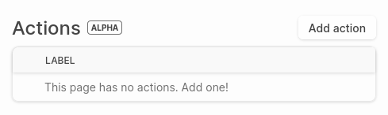
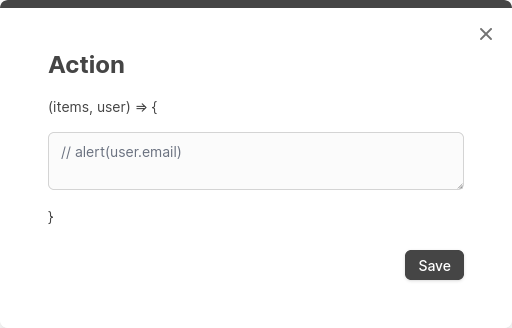
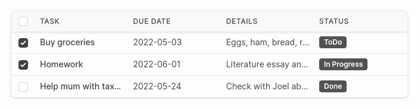
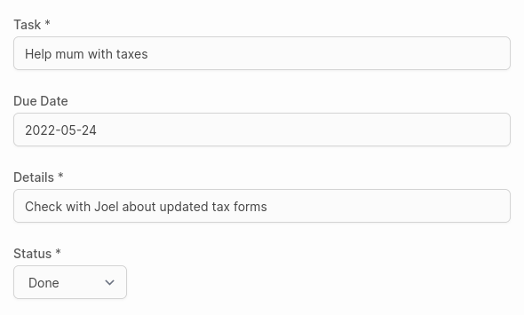

# Actions



Actions, otherwise known as triggers, are custom Javascript functions that can be added into Dashibase and triggered via buttons.

Each action is defined by two properties.

- `label` - the label that will be on the button
- `code` - the Javascript code that will be executed when the button is clicked

Currently, the code handles any vanilla Javascript and takes in two variables `user` and `items`.

**Hosted version**

In the hosted version, an Action can be created by clicking on the "Add action" button (see above). Clicking "Edit" on the new Action displays a popup for entering the code to be executed.



**Self-hosted version**

In the self-hosted version, an Action can be added to the `triggers` attribute of the config file. The sample `src/dashibaseConfig.ts` has [an example](https://github.com/Dashibase/dashibase/blob/8f6bba57c66990324a023269abbb8c7821f2e5b6/src/dashibaseConfig.ts#L46-L50) of how to do this.

**Action variables**

The code executed by the Action can access two varaibles user and items, representing the logged-in user and the selected items respectively.

**user**

`user` is an Object representing the user who is currently logged in. Dashibase retrieves this via `supabase.auth.user()`.

Useful properties of `user`:

- `user.id` - UUID from the auth.users table
- `user.role` - Role of user
- `user.email` - Email of user
- `user.last_sign_in_at` - Timestamp of last sign in

For instance, setting the Action's `code` to `alert(user.email)` will display an alert box that prints the user's email when the button is clicked.

**items**

`items` is an Array representing a list of items from the current Supabase table.

On a Card or List view, `items` will be an Array of the currently selected items, each represented as an Object.



In the case of the above image:

```
items = [{
  task: "Buy groceries",
  due_date: "2022-05-03",
  details: "Eggs, ham, bread, rice",
  status: "ToDo",
}, {
  task: "Homework",
  due_date: "2022-06-01",
  details: "Literature essay and math",
  status: "In Progress",
}]
```

On a Single view, `items` will be an Array of a single Object, with properties and values defined by the columns and column values of the displayed item.



In the case of the above image:

```
items = [{
  task: "Help mum with taxes",
  due_date: "2022-05-24",
  details: "Check with Joel about updated tax forms",
  status: "Done",
}]
```

As an example, setting the Action's `code` to alert(items[0].task) will display an alert box that prints the `task` property of the first/current item.
