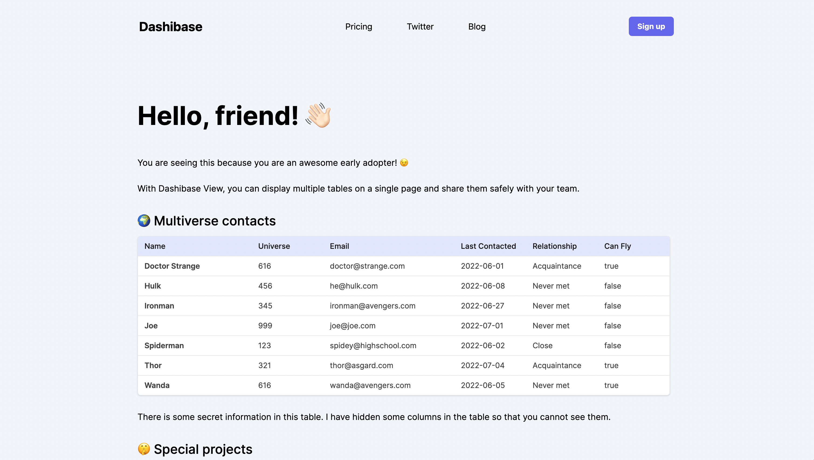
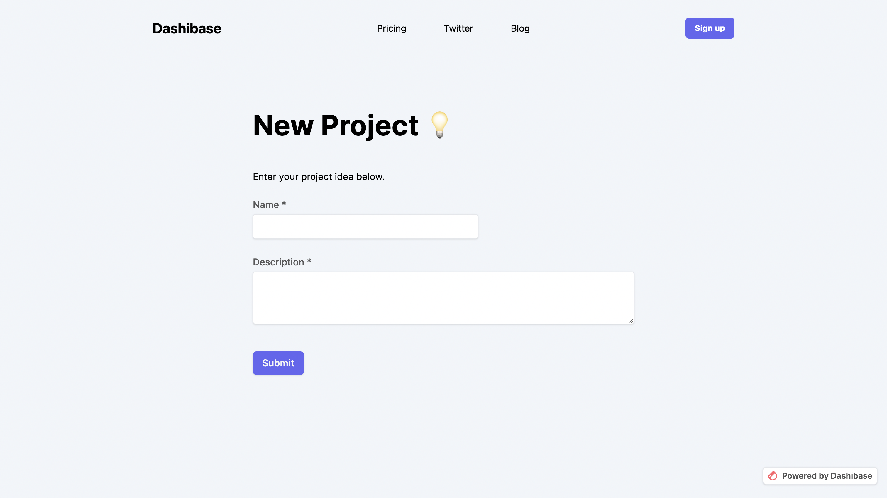

# Styling Your Forms and Table Views with CSS

After creating and embedding your forms and tables, you can customize their look and feel using CSS.

## Examples

1. Styling table header row

  

2. Styling form labels and button

  

## Reference table

Here are the respective CSS selectors you can use to style your forms and tables:

| CSS Selector | Name/Type	| Description |
| ------------ | ---------- | ----------- |
| div::part(dashi)| Overall div| This div element wraps around the entire form or table view. | 
| div::part(dashi-embed)| Embed form or table div| The main form or table view element. | 
| div::part(dashi-title)| Title| The title of the form or table view. | 
| div::part(dashi-h1),  div::part(dashi-h2),  div::part(dashi-text)| H1, H2, Text| The headings and text of the form or table view. | 
| div::part(dashi-divider)| Divider| The divider in the form or table view. | 
| div::part(dashi-label)| Input labels| The labels above the input boxes. | 
| div::part(dashi-table)| Table| All tables in a table view. Good for styling the table color. | 
| div::part(dashi-table-title)| Table title| The title of all tables in a table view. | 
| div::part(dashi-table-header)| Table header row| The first row of all tables in a table view. Good for matching your website’s colors. | 
| div::part(dashi-button)| Button| The password enter and form submit button. Good for matching your website’s colors. | 
| div::part(dashi-password)| Overall password div| The div element on the password page. | 

**Note:**

1. You cannot style the children of the above-mentioned elements because we are using the Shadow DOM for the embed. [This Stack Overflow answer](https://stackoverflow.com/questions/67940807/style-children-of-shadow-dom-part-element) has a helpful explanation and links to extra readings.
2. The table width is determined via the editor. If you want to adjust the table or column width, we recommend doing that in the editor.
3. It's not possible to style input boxes at the moment.